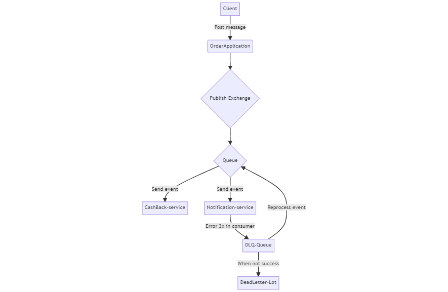

# RabbitMQ

## Main objective

This project is implementation the rabbitmq with process, retry and dead letter manager.


## Pre requisites
It's necessary upped mysql database and rabbitMQ before run projects. 
Run the command below in project root:
```shell
docker compose -f docker-compose.yml up 
```


## Diagram




[//]: # (flowchart TD)

[//]: # (A[Client] -->|Post message| B&#40;OrderApplication&#41;)

[//]: # (B --> C{Publish Exchange})

[//]: # (C --> D{Queue})

[//]: # (D -->|Send event| E[CashBack-service])

[//]: # (D -->|Send event| F[Notification-service])

[//]: # (F -->|Error 3x in consumer| G[DLQ-Queue])

[//]: # (G -->|Reprocess event| D)

[//]: # (G -->|When not success| H[DeadLetter-Lot])
